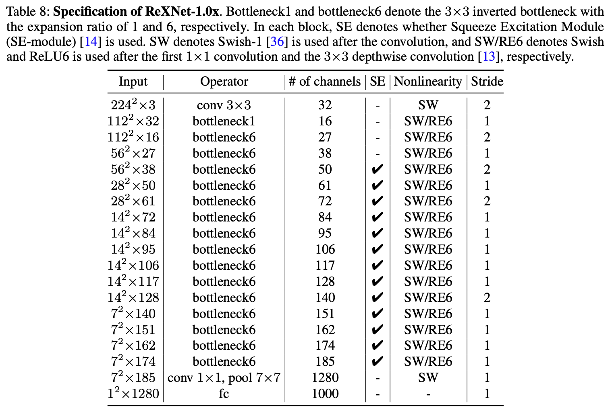

[TensorFlow 2] ReXNet: Diminishing Representational Bottleneck on Convolutional Neural Network
=====

Unofficial TensorFlow implementation of "ReXNet: Diminishing Representational Bottleneck on Convolutional Neural Network".  
Official PyTorch implementation is provided as the following link.  
https://github.com/clovaai/rexnet  

* Note that, the detailed neural network architecture is different with the original paper [1].  
* This repository only contains the shorten neural network reflecting the concept.  

## Concept
<div align="center">
    
  <p>Spec of ReXNet-v1[1].</p>
</div>

## Performance

|Indicator|Value|
|:---|:---:|
|Accuracy|0.-----|
|Precision|0.-----|
|Recall|0.-----|
|F1-Score|0.-----|

```
Confusion Matrix
```

## Requirements
* Python 3.7.6  
* Tensorflow 2.1.0  
* Numpy 1.18.1  
* Matplotlib 3.1.3  

## Reference
[1] Dongyoon Han et al. (2020). <a href="https://arxiv.org/abs/2007.00992">ReXNet: Diminishing Representational Bottleneck on Convolutional Neural Network</a>. arXiv preprint arXiv:2007.00992.
